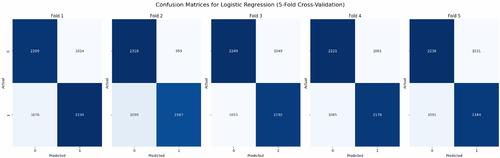
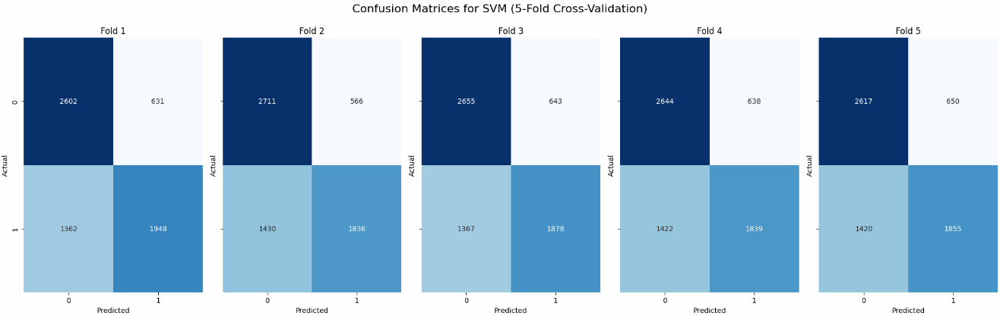
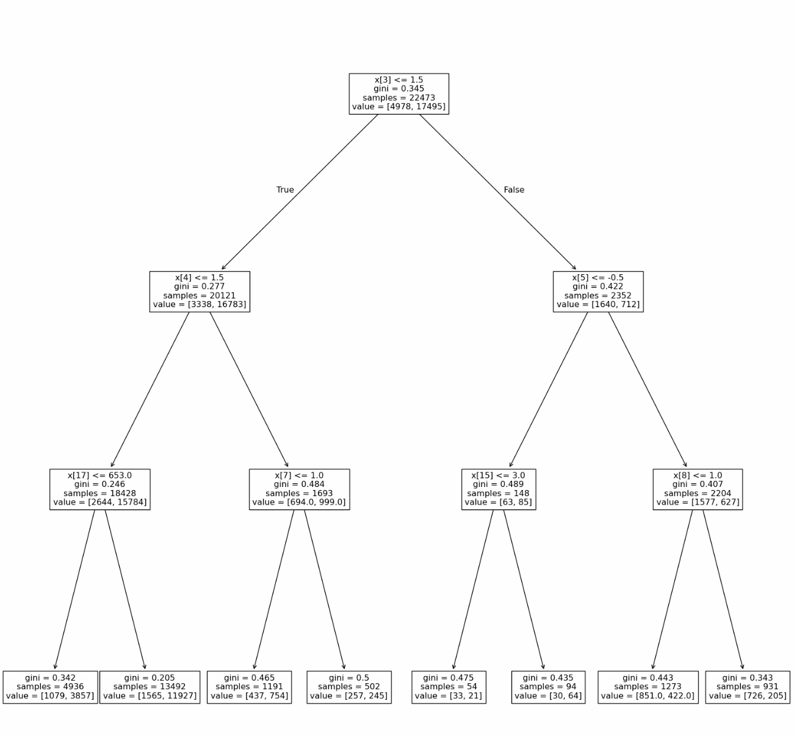
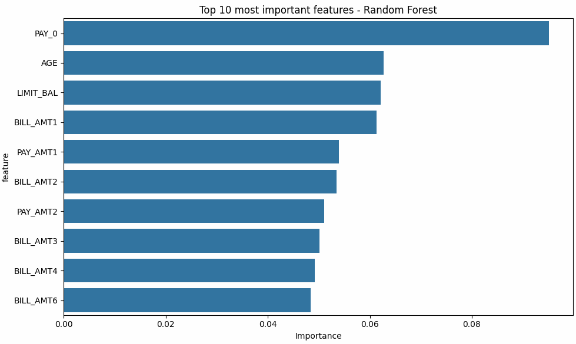
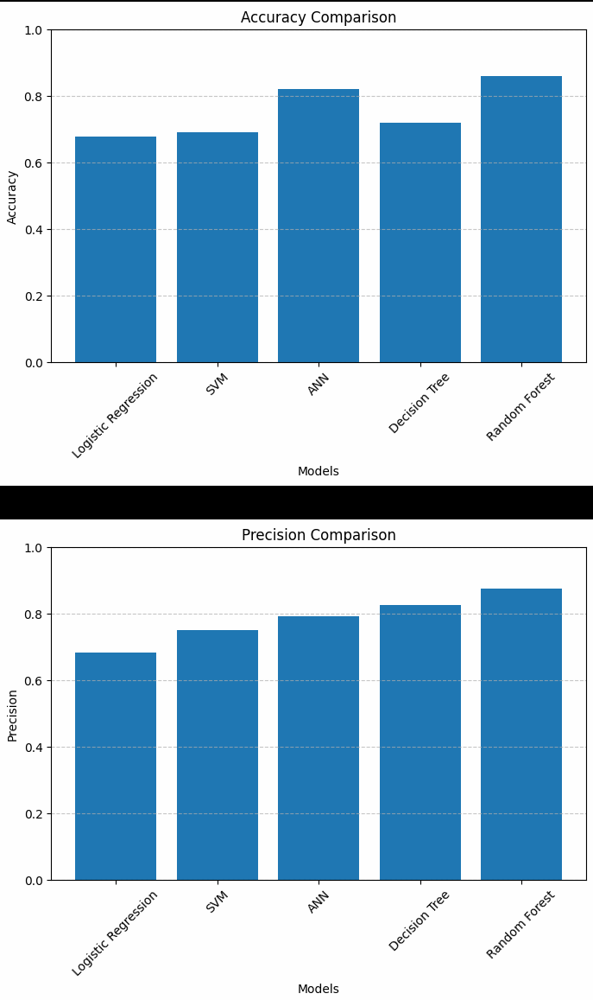

# ML_CS6220_Final
## CS6220 - Data Mining Techniques: Final Project

## Description
## Techniques Used for the Project
``` python
import numpy as np
import pandas as pd
import matplotlib.pyplot as plt
from sklearn import model_selection, neural_network
import seaborn as sns
import random
import time

from imblearn.over_sampling import SMOTE
from sklearn.model_selection import train_test_split, KFold
from sklearn.metrics import accuracy_score, precision_score, recall_score, f1_score, confusion_matrix, ConfusionMatrixDisplay
from sklearn.preprocessing import StandardScaler
from sklearn.linear_model import LogisticRegression
from sklearn.svm import SVC
from sklearn.ensemble import RandomForestClassifier

from imblearn.over_sampling import SMOTE
```

## Processing of the Project






## Conclusion of the Project